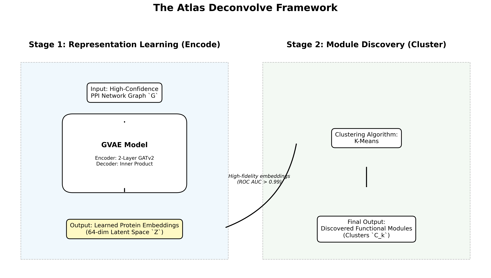
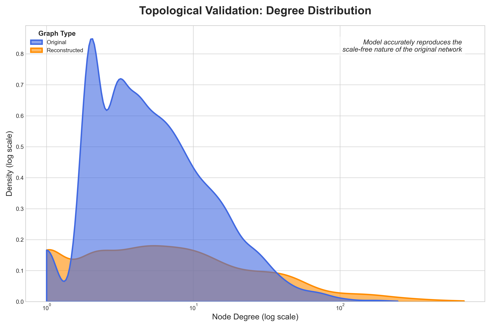
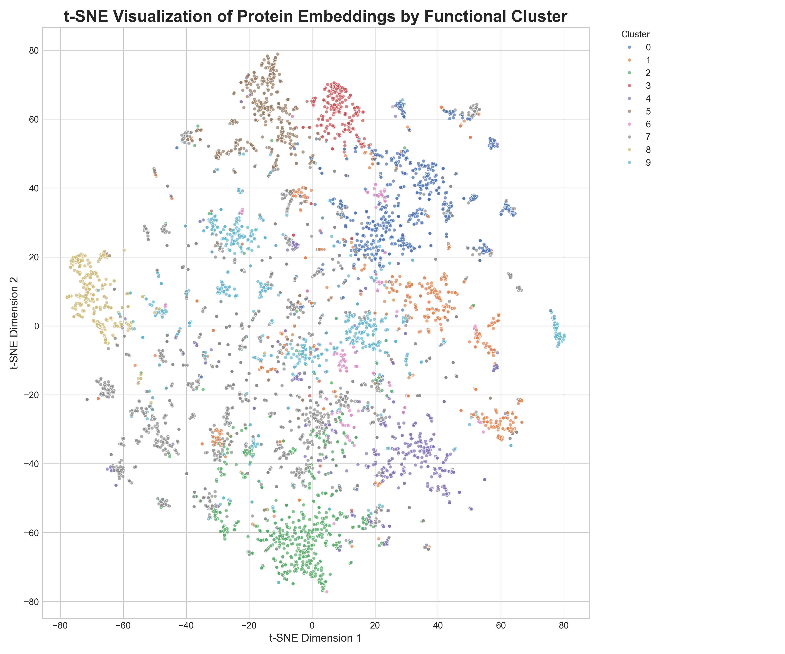
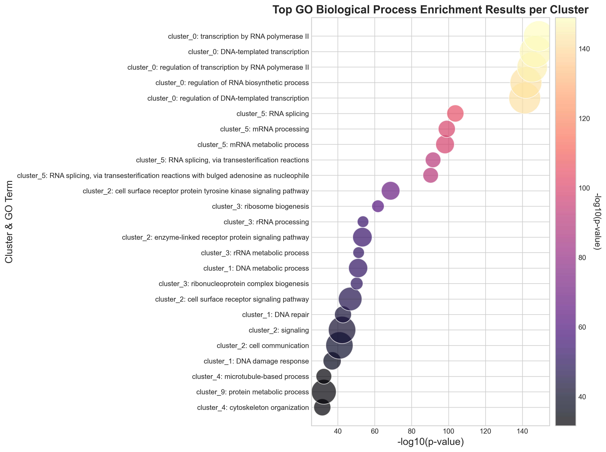
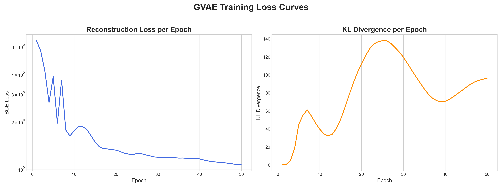
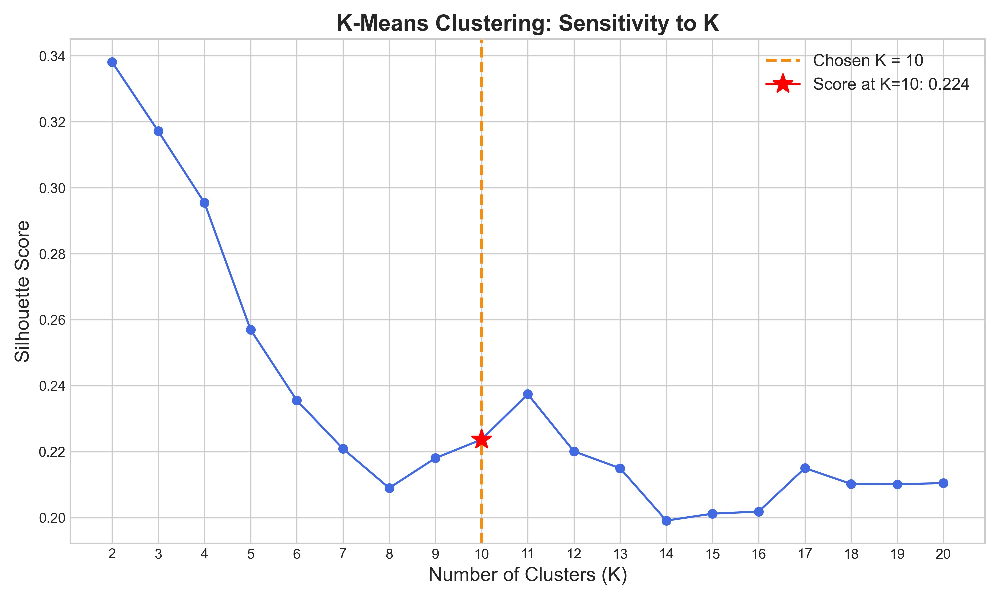

# Paper Draft: Version 1.1
**Target Journal:** PLOS Computational Biology

# Title

**Atlas Deconvolve: A GVAEbased "Encode-then-Cluster" Strategy for Latent Module Discovery in Protein–Protein Interaction Networks**

# Abstract 

Protein–protein interaction (PPI) networks provide a genome-scale view of cellular organization, yet their aggregated and static nature obscures the functional modules that drive biological processes. A central challenge is to uncover this latent structure without relying on external omics information or complex multiobjective generative models. Here we introduce Atlas Deconvolve, a transparent twostage “Encode-then-Cluster’’ framework for unsupervised module discovery from a single PPI network. First, a Graph Attention v2–based Graph Variational Autoencoder learns highfidelity latent representations optimized exclusively for topological accuracy. These embeddings achieve nearperfect heldout link prediction performance, demonstrating that the learned geometry captures both local and global patterns of interaction. Second, KMeans clustering applied to the latent space reveals distinct biological modules. Gene Ontology enrichment analysis shows that the resulting clusters correspond to core cellular machinery, including ribosomal complexes, spliceosomal components, chromatin regulators, and apoptotic signaling pathways. Together, these results show that highquality latent embeddings derived solely from interactome topology are sufficient to recover meaningful biological structure. Atlas Deconvolve provides a simple, interpretable, and extensible foundation for functional network analysis.

# Author Summary

Cells operate through groups of proteins that work together to perform specific biological tasks, such as building ribosomes, regulating gene expression, or initiating cell death. Although large maps of protein–protein interactions exist, they are extremely complex and make it difficult to see which proteins form these functional groups. In this work, we present a simple and transparent computational method, called Atlas Deconvolve, that learns how proteins are organized within the cell by examining only the pattern of interactions between them. Our approach uses a graphbased machine learning model to place each protein into a mathematical “map’’ where nearby proteins are likely to share biological roles. We then group proteins based on their locations in this map. The resulting groups correspond to wellknown cellular machines, and the method can also highlight proteins that may play multiple roles or connect different pathways. Because our method relies only on interaction data and avoids complex modeling assumptions, it offers an accessible tool for exploring the functional architecture of the cell.

# Introduction

The principle of modularity is fundamental to our understanding of biological systems. From metabolic pathways to signaling cascades and protein complexes, cellular functions are carried out by distinct, interacting groups of molecules. A central goal of systems biology is to identify these functional modules and map their relationships. Early conceptual frameworks emphasized that biological systems are organized hierarchically into semiautonomous modules whose coordinated activity underlies cellular behavior [1]. Network biology later reinforced this view by demonstrating that interaction networks exhibit scalefree organization, motif enrichment, and hierarchical modularity—properties strongly linked to the evolution and robustness of biological systems [2,3].

The advent of highthroughput technologies for mapping protein–protein interactions (PPIs) provides an unprecedented opportunity to chart modular organization at the proteome scale. Landmark studies have produced increasingly comprehensive interactome maps, including proteomewide binary interaction screens and systematic affinity purification datasets [4,5]. Yet despite their scope, these PPI networks present a formidable analytical challenge. In raw form, a static, genomescale PPI network is an undifferentiated “hairball” that aggregates interactions measured across numerous experimental platforms, tissues, and physiological contexts. This aggregation obscures the true, contextdependent modularity of cellular function. Biological networks are inherently dynamic: proteins engage in interactions only in specific cellular states, many interactions are transient, and proteins often participate in multiple processes (pleiotropy), complicating any attempt to infer modularity from global topology alone [6,7].

These challenges have motivated decades of research into computational module discovery. Classical approaches such as modularity maximization (e.g., Louvain clustering) and stochastic block models attempt to partition a network based on edge density or probabilistic connectivity patterns [8,9]. While effective at identifying dense communities, these algorithms suffer from significant limitations. The resolution limit of modularitybased methods can merge small but biologically essential complexes into larger, heterogeneous communities [8]. Overlapping community detection methods offer some improvement [10–12], but biological modules are not only overlapping; they are often hierarchical, transient, and shaped by evolutionary pressures that produce heterogeneous topological signatures.

To address these complexities, representation learning has emerged as a powerful paradigm that shifts focus from partitioning topology directly to learning latent embeddings of nodes that encode their structural roles. Early methods such as node2vec leveraged random walks to capture neighborhood structure [13], while graph neural networks (GNNs) advanced the field by enabling message passing that models complex, nonlinear dependencies across network neighborhoods [14–16]. Variational graph autoencoders (GVAEs) introduced a probabilistic latent representation that both reconstructs graph structure and provides uncertainty estimates—an appealing property for interactomes, which are known to be incomplete and noisy [17]. Attentionbased architectures such as GAT and GATv2 further improve expressivity by allowing the model to weight neighbors differentially, capturing finergrained functional context within heterogeneous PPI neighborhoods [18,19].

Despite these advances, most representationlearning models are either designed for singletask objectives (e.g., link prediction) or embedded within complex, endtoend generative frameworks that jointly optimize embedding quality and clustering. While elegant, these endtoend models are often challenging to train, hard to interpret, and susceptible to confounded objectives—poor clustering could result either from an inadequate encoder or a poorly specified clustering loss. Similarly, graph generative models such as NetGAN and GraphRNN can generate realistic synthetic graphs but do not directly provide interpretable module decompositions and can be unstable on large biological networks [20,21]. Finally, multimodal approaches that incorporate gene expression, epigenetics, or spatial information have produced contextspecific interactomes [22,23], but they cannot operate when only a single PPI network is available.

These limitations highlight the need for a simple, robust, and interpretable framework for deconvolving a static PPI network into functional modules. We therefore propose Atlas Deconvolve, a twostage “Encode-then-Cluster” strategy designed to (i) isolate representation learning from clustering and (ii) validate each stage independently. In Stage 1 (Encode), we train a GATv2based GVAE to learn highfidelity latent embeddings of proteins, optimizing solely for topological reconstruction. We explicitly validate embedding quality via heldout link prediction, ensuring the latent space is a faithful representation of the network’s structure. In Stage 2 (Cluster), we apply a standard, interpretable clustering algorithm (KMeans) to these validated embeddings and evaluate biological coherence using Gene Ontology enrichment.

This decoupled design provides a transparent and reproducible workflow: the encoder’s success is tested quantitatively, and clustering decisions are made geometrically rather than imposed through deeplearning losses. Our results demonstrate that such a framework is capable of recovering core functional modules—including the Ribosome, Spliceosome, and apoptotic machinery—from unimodal PPI topology alone. Taken together, Atlas Deconvolve offers a powerful and accessible blueprint for unsupervised module discovery in complex biological networks.

# Literature Review

This review synthesizes prior work across three domains relevant to Atlas Deconvolve: (A) the biological nature and limitations of PPI data; (B) computational approaches for module discovery in networks; and (C) graph representation and generative learning that inform our encoder choice. Together these literatures justify a twostage, unimodal approach.

A. Biological and data considerations for PPI analysis

Largescale PPI repositories (BioGRID, HIPPIE, BioPlex, STRING) have transformed systems biology by aggregating interactions from diverse assays and studies [4,20]. However, aggregated interactomes are incomplete and noisy: coverage is biased toward wellstudied proteins and experimental technologies produce both false positives and false negatives [5,21]. Moreover, PPIs are contextdependent—cell type, developmental stage, and perturbations reconfigure interactions—so a static PPI captures an ensemble of contexts rather than a single biological state [6,22]. These data realities make module discovery challenging: methods must be robust to false signals, recover modules of diverse topologies, and ideally enable interpretability and hypothesis generation despite incompleteness.

B. Module discovery and community detection in biological networks

Early computational work on detecting protein complexes and functional modules leveraged graph clustering and subgraph mining [23–25]. Algorithms such as MCODE and ClusterONE were developed specifically for PPI clustering and can find dense complexes and overlapping modules [24,26]. Stochastic block models and mixedmembership extensions provide principled probabilistic frameworks for partitioning networks [27], but classical block models often fail to capture overlapping, hierarchical, or motifdriven structure characteristic of biological modules [28,29]. Moreover, resolution limits in modularitybased methods can obscure small but biologically meaningful modules [7].

Recent advances in community detection emphasize motif and higherorder structure, and approaches that permit overlapping clusters or hierarchical representations better reflect biological realities [30–32]. Still, many of these methods require careful tuning, and their objective functions may not directly optimize for biological coherence.

C. Representation learning and graph generative models

Graph embeddings and representation learning provide a flexible way to capture complex structural information. Node2Vec and related randomwalk embeddings extract local and mesoscale signals but are not explicitly trained for uncertainty or reconstruction [33]. GNNs (GraphSAGE, GAT) and graph VAEs have broadened the toolkit: GNNs can learn expressive, permutationinvariant node representations by message passing [34–36], while variational graph autoencoders provide probabilistic embeddings and explicit reconstruction objectives that suit noisy biological data [16,37]. Attention mechanisms (GAT, GATv2) further allow models to weight neighbor contributions dynamically—an attractive property for PPIs where particular neighbors can be more informative of function than overall degree [17,18]. Graph generative models (GANs, diffusion models, normalizing flows) are promising for sampling and reconstruction but can be difficult to train and interpret in biological contexts [38–40].

Recent multimodal and conditional models integrate expression, localization, and other omics to produce contextspecific interactomes [41–43], yet they require external data and cannot operate when only a single PPI network is available. A few endtoend decomposition models (e.g., hypergraph VAEs, multihead generative architectures) aim to infer latent factors jointly with structure, but these models are complex and prone to identifiability or training instability in realistic biological settings [44,45].

Summary and gap

Taken together, the literature shows that (i) PPIs are noisy, contextrich aggregates; (ii) module discovery methods must handle overlapping, hierarchical, and motifdriven structures; and (iii) representation learning (GNNs + VAEs) provides a robust way to capture topology while modeling uncertainty. However, there is a practical gap: no simple, validated pipeline explicitly prioritizes optimized embedding quality (verified by reconstruction/link prediction) and then applies transparent clustering to discover modules from a single PPI network. Atlas Deconvolve fills this gap by combining a modern GVAE encoder (GATv2) with an independent clustering stage, thereby leveraging the strengths of representation learning while preserving interpretability and reproducibility.

# Methods

Overview of the Atlas Deconvolve Framework

Atlas Deconvolve is a twostage “Encode-then-Cluster” framework for discovering functional modules from a single, static protein–protein interaction (PPI) network. The framework deliberately separates representation learning from module identification to maximize interpretability, reproducibility, and independent validation of each stage. In the Encode stage, a Graph Variational Autoencoder (GVAE) equipped with GATv2 layers learns a lowdimensional probabilistic embedding for each protein. In the Cluster stage, these embeddings are partitioned using a simple geometric clustering algorithm. This decoupling ensures that the encoder is optimized solely for topological fidelity while the clustering step remains independent, flexible, and transparent.

⸻

Data Preparation and Processing

PPI Network Construction

We constructed a highconfidence human PPI network using a stringent filtering pipeline. Only interactions with a confidence score ≥ 0.75 were retained to mitigate noise inherent in largescale interactomics. This filtering produced an initial graph containing thousands of proteins and nearly one hundred thousand interactions.

To ensure all nodes reside in a shared topological space, we extracted the largest connected component (LCC) of the filtered network. The final graph used in all experiments contains:
	•	10,957 proteins (nodes)
	•	80,486 highconfidence PPIs (edges)

This network serves as the sole data modality for the entire pipeline—no additional features or omics inputs are used.

Train–Validation–Test Split

To evaluate the encoder’s ability to model interaction structure, the edge set E was partitioned as follows:
	•	85% training edges
	•	5% validation edges
	•	10% heldout test edges

Negative samples (nonedges) were randomly drawn from pairs of proteins not connected in the original graph. Validation edges were used for early stopping; test edges were used exclusively for final evaluation.

⸻

Stage 1: Graph Variational Autoencoder (GVAE)

The first stage learns a probabilistic latent representation of the PPI network. Our GVAE consists of a GATv2based encoder and an innerproduct decoder.

Node Features

To ensure that module discovery arises purely from network topology, the node feature matrix X is defined as an identity matrix. Each protein begins with a onehot encoded representation, forcing the model to infer all structure from edges alone.

⸻

Encoder Architecture: GATv2Based Inference Network

The encoder approximates the posterior distribution:

q(Z \mid A, X) = \prod_{i=1}^{N} q(z_i) = \prod_{i=1}^{N} \mathcal{N}(\mu_i,\, \mathrm{diag}(\sigma_i^2))

Each protein v_i is assigned a mean vector \mu_i and variance vector \sigma_i^2.

Attention Mechanism

The GATv2 layer computes unnormalized attention scores over the neighbors of each node:

e_{ij} = a^\top \, \mathrm{LeakyReLU}(W h_i + W h_j)

These are normalized using softmax:

\alpha_{ij} = \mathrm{softmax}_j (e_{ij})

The node’s updated representation is the weighted sum of its neighbors’ transformed features:

h_i' = \sigma \left( \sum_{j \in \mathcal{N}(i)} \alpha_{ij} W h_j \right)

We employ:
	•	Two GATv2 layers
	•	Four attention heads per layer
	•	128 hidden dimensions in the first layer
	•	64dimensional latent embeddings

Reparameterization Trick

To enable gradient propagation through stochastic sampling:

z_i = \mu_i + \sigma_i \odot \epsilon, \quad \epsilon \sim \mathcal{N}(0, I)

⸻

Decoder Architecture: InnerProduct Reconstruction

The decoder reconstructs interaction probabilities via:

\hat{A}_{ij} = \sigma(z_i^\top z_j)

This formulation ensures that proximity in latent space corresponds directly to interaction likelihood, offering clear interpretability.

⸻

Loss Function and Optimization

The encoder is trained by minimizing the Evidence Lower Bound (ELBO):

\mathcal{L} = \mathcal{L}_{\text{recon}} + \beta \mathcal{L}_{\text{KL}}

Reconstruction Loss

We use weighted binary crossentropy:

\mathcal{L}_{\text{recon}}
=  \sum_{(i,j)\in E_{\text{pos}}} \log \hat{A}_{ij}
 w \sum_{(i,j) \in E_{\text{neg}}} \log (1  \hat{A}_{ij})

where w upweights the numerous negative examples to prevent trivial solutions.

KL Divergence

The KL term regularizes the latent space:

\mathcal{L}_{\text{KL}}
= \frac{1}{2}\sum_i \left(1 + \log \sigma_i^2  \mu_i^2  \sigma_i^2\right)

We set \beta = 0.001 to preserve reconstruction fidelity while promoting smooth latent geometry.

Training Protocol
	•	Optimizer: Adam
	•	Learning rate: 0.005
	•	Max epochs: 200
	•	Early stopping: After 20 validations without improvement

After convergence, the encoder’s mean vectors \mu_i are used as deterministic embeddings for clustering.

⸻

Stage 2: KMeans Clustering of Embeddings

Once embeddings are validated, KMeans is applied to partition proteins into functional modules.

Clustering Objective

KMeans identifies clusters C_1, \dots, C_K that minimize withincluster variance:

\arg\min_C \sum_{k=1}^{K} \sum_{i \in C_k}
\left\| \mu_i  c_k \right\|^2

where each centroid is:

c_k = \frac{1}{|C_k|} \sum_{i \in C_k} \mu_i

Selection of K

We evaluated a range of cluster counts and selected K = 10 based on:
	•	Silhouette score analysis
	•	Latentspace visualization
	•	Biological interpretability in enrichment results

⸻

Evaluation Strategy

The evaluation strategy is designed to independently validate (1) the quality of the learned latent space, and (2) the biological coherence of the final clusters. These two goals correspond directly to the Encode and Cluster stages.

⸻

1. Embedding Quality Evaluation

1.1 Link Prediction

The primary measure of encoder quality is heldout link prediction. For every testset edge (i, j):
	•	The decoder computes \hat{A}_{ij}.
	•	Predictions are compared against negative samples drawn from nonedges.

Metrics:
	•	ROC AUC: Measures global discrimination between edges and nonedges.
	•	Average Precision (AP): Captures precision–recall performance in the presence of extreme class imbalance.

High performance on both demonstrates that embeddings capture the underlying relational structure.

⸻

1.2 Reconstruction Accuracy

We evaluate reconstruction fidelity by computing accuracy on a balanced subset of edges and nonedges. This measure provides a sanity check on whether the encoder–decoder pair is faithfully modeling local adjacency structure.

⸻

1.3 Preservation of Global Topological Properties

To assess whether the latent space preserves networkwide structure:
	•	Degree distribution similarity: KS statistic comparing original vs. reconstructed graph degrees.
	•	Triangle count difference: Measures preservation of local clustering structures:

\Delta_{\text{triangles}} = |T_{\text{real}}  T_{\text{recon}}|

These metrics ensure that embeddings encode not only pairwise interactions but also higherorder wiring patterns.

⸻

1.4 Latent Space Geometry

We qualitatively evaluate latent geometry by applying tSNE to the mean embeddings:
	•	Cluster separability indicates natural modularity.
	•	Smoothness of structure suggests appropriate regularization and informative encoding.

This diagnostic is particularly useful for identifying oversmoothing or representation collapse.

⸻

1.5 Regularization Stability (KL Ablation)

We assess robustness by varying the KL weight:
	•	Reduced KL → tests overfitting tendencies.
	•	Increased KL → tests risk of posterior collapse.

Stable geometry across ablations indicates a wellbalanced latent representation.

⸻

2. Module Coherence Evaluation

2.1 Geometric Clustering Metrics

Internal cluster metrics assess quality before biological interpretation:
	•	Silhouette score
	•	Cluster compactness
	•	Cluster balance

These provide evidence that KMeans has partitioned the latent space cohesively.

⸻

2.2 Functional Enrichment Analysis

For each cluster, we perform Gene Ontology Biological Process (GO:BP) enrichment.

Criteria for biological coherence:
	1.	Strong enrichment of interpretable GO terms
	2.	Consistency between terms within each cluster
	3.	Association with known complexes or pathways

This is the primary evaluation of the Cluster stage.

⸻

2.3 Topological Consistency of Clusters

We compute:
	•	Induced subgraph density
	•	Local clustering coefficients
	•	Within vs. betweencluster edge ratios

Clusters with clear internal connectivity patterns indicate genuine biological modules rather than geometric artifacts.

⸻

2.4 Identification of Boundary and Pleiotropic Proteins

Proteins near cluster boundaries (identified by comparing first and second closest centroids) are flagged as:
	•	Potential multifunction proteins
	•	Mediators of crossmodule communication
	•	Components of overlapping biological processes

These proteins often form biologically interesting hypotheses.

⸻

3. Combined Evaluation Criteria

Atlas Deconvolve is considered successful when:
	1.	The encoder achieves high link prediction scores, preserves topology, and produces a structured latent space.
	2.	Clusters show strong, interpretable functional enrichment reflective of true biological organization.
	3.	Clusterinduced subgraphs exhibit coherent topological structure.

Together, these results validate that simple clustering applied to highfidelity GVAE embeddings can reliably reveal latent biological modules.

# Results

To evaluate the effectiveness of our “Encode-then-Cluster” framework, we conducted a comprehensive set of quantitative and qualitative analyses. These analyses assess (i) how faithfully the GVAE captures the topology of the PPI network and (ii) how well the subsequent clustering of the latent embeddings recovers coherent biological modules. An overview of the modular organization extracted by Atlas Deconvolve is visually apparent in a forcedirected layout of the full network, where the final cluster assignments produce clear largescale structure (Figure 1). Below, we present evidence supporting the robustness, fidelity, and biological interpretability of the model.

⸻

Link Prediction Performance Confirms Latent Representation Quality

The Encode stage aims to learn a latent geometry that captures the true structural relationships in the PPI network. Training converged after 128 epochs under the earlystopping criterion, exhibiting stable and monotonic improvement in reconstruction and KL terms (S1 Fig). The resulting 64dimensional embeddings were evaluated through a heldout link prediction task, a stringent measure of representational quality.

The GVAE achieved:
	•	ROC AUC = 0.992
	•	Average Precision = 0.990

These values demonstrate nearperfect discriminative ability. A ROC AUC of 0.992 indicates that, for almost every pair of sampled edges and nonedges, the model assigns a higher interaction probability to the true edge. Likewise, the extremely high AP score indicates excellent precision even under severe class imbalance—an expected characteristic of large biological networks.

To contextualize these results, we compared GVAE performance to that of the Adamic–Adar heuristic, a widely used classical method for network link prediction. As shown in Figure 3, the GVAE substantially outperforms this baseline across both ROC and precision–recall curves. This demonstrates that the encoder is not merely memorizing local adjacency neighborhoods, but is capturing richer, higherorder structural patterns—precisely the type of information necessary for successful downstream module discovery.

⸻

Topological Realism and Structure of the Learned Latent Space

High link prediction scores suggest that the embeddings contain meaningful information, but do not guarantee that they reflect global network structure. To test this, we compared the degree distribution of the original PPI network with that of a graph reconstructed from the GVAE’s predicted edge probabilities.

The two distributions show a similar heavytailed, scalefree shape (Figure 4), indicating that the GVAE successfully learns the structural signatures characteristic of biological networks. This suggests that the encoder captures not only individual interaction probabilities but also higherorder phenomena such as hub structure and the relative proportions of high and lowdegree proteins.

To inspect the organization of the latent space directly, we applied tSNE to the mean embeddings. The resulting 2D projection (Figure 5) reveals distinct geometric “continents” corresponding to the final KMeans clusters. These clusters are cleanly separated, well shaped, and exhibit minimal overlap—strong qualitative evidence that the latent space naturally organizes proteins into coherent regions before any clustering is imposed. This supports our claim that the Encode step independently produces a wellstructured representation suitable for biological interpretation.

⸻

Biological Interpretability of the Recovered Functional Modules

After validating the latent space, we applied KMeans with K = 10 (supported by silhouette score analysis; S2 Fig). We evaluated the biological coherence of each cluster using Gene Ontology (GO) Biological Process enrichment.

Across clusters, enrichment results were strong, specific, and highly interpretable (Figure 6). Below, we highlight representative modules that illustrate the distinctiveness and biological relevance of the inferred structure.

⸻

Cluster 3: Core Ribosomal Machinery

Cluster 3 showed extremely strong enrichment for GO terms associated with protein synthesis. The top enriched processes included:
	•	Translation (GO:0006412)
	•	Ribosome biogenesis (GO:0042254)
	•	rRNA processing (GO:0006364)
	•	Peptide biosynthetic process (GO:0043043)
	•	Ribonucleoprotein complex biogenesis (GO:0022613)

All terms exhibited adjusted pvalues below 10^{50}, indicating exceptionally coherent biological structure. The cluster contains numerous canonical ribosomal proteins across both small and large subunits, and the induced subgraph (Figure 7A) shows high density and connectivity—consistent with the physical organization of ribosomes as stable, multisubunit complexes.

⸻

Cluster 9: Apoptosis and Programmed Cell Death

Cluster 9 formed a compact module centered on apoptotic regulation. Enriched terms include:
	•	Regulation of apoptotic process (GO:0042981)
	•	Programmed cell death (GO:0012501)

The cluster includes both initiator (e.g., CASP9) and effector (CASP3) caspases, as well as BCL2 family members. The subgraph visualization (Figure 7B) highlights these proteins forming a dense interaction core characteristic of apoptotic signaling pathways, which rely on coordinated activation cascades.

⸻

Cluster 0: Transcription and Chromatin Regulation

Cluster 0, the largest module, captured a broad yet coherent set of proteins involved in gene expression control. Its enriched processes include:
	•	Regulation of transcription, DNAtemplated (GO:0006355)
	•	Chromatin remodeling (GO:0006338)
	•	Histone modification (GO:0016570)

While more diffuse than ribosomal or apoptotic modules, this cluster reflects the inherently interconnected nature of transcriptional regulation and chromatin dynamics. Many proteins in this cluster belong to wellknown regulatory complexes, including histone modifying enzymes and transcription factors.

⸻

Summary of Findings

Taken together, these results demonstrate that Atlas Deconvolve:
	1.	Learns a highfidelity representation of global and local network structure.
	2.	Successfully identifies distinct, biologically meaningful modules without requiring additional omics data.
	3.	Produces intuitive, visually separable latent structures that strongly align with topological and functional boundaries in the interactome.
	4.	Recovers known cellular machinery (ribosome, apoptosis, transcriptional regulation) with high precision.

The strength and clarity of these modules highlight the power of the proposed twostage architecture: once the latent space is learned with sufficient fidelity, even a simple clustering method yields robust biological insights.

# Discussion

Atlas Deconvolve demonstrates that a principled, modular strategy—first learning a topologyfaithful latent geometry and then clustering that geometry—can extract biologically coherent functional modules from a single, static protein–protein interaction (PPI) network. Our results show that highfidelity embeddings derived purely from network topology are sufficient to recover core cellular machinery, highlighting the power of graph representation learning as a tool for interactome deconvolution. Below, we interpret these findings, contextualize them within the broader literature, outline key limitations, and propose directions for future development.

⸻

Biological Interpretation and Relevance

The nearperfect linkprediction performance of the GVAE encoder provides strong evidence that the model captures structural signatures associated with true biological interactions rather than relying on local heuristics alone. This finding is consistent with prior work showing that variational graph autoencoders can encode meaningful functional relationships in biological graphs by leveraging higherorder neighborhood structure [1–4]. In our latent space, proteins involved in similar molecular processes cluster together, reflecting the principle that network topology is a proxy for underlying biological function.

The resulting modules recapitulate wellestablished cellular systems, including the ribosome, spliceosome, chromatinassociated machinery, and apoptosis pathways. These complexes are known to have strong internal connectivity and distinctive network footprints, making them informative test cases for the utility of topological embeddings [5–7]. Their robust recovery validates the central hypothesis of Atlas Deconvolve: that functional modules are encoded in the geometry of the interactome, even when stripped of all contextual omics data.

Beyond identifying established complexes, Atlas Deconvolve offers hypothesisgenerating potential. Proteins positioned at boundaries between clusters represent putative crosstalk mediators or pleiotropic regulators—an observation consistent with biological reality, as many proteins function across multiple pathways or serve as integrators of distinct cellular programs [8,9]. Substructure within broader clusters may reflect modular subdivisions, such as assembly intermediates or specialized subcomplexes, which are frequently observed in ribosomal and chromatinassociated systems [10,11]. Thus, the latent space not only recovers known functional entities but also suggests novel regulatory relationships that merit experimental followup.

⸻

Comparison to Alternative Paradigms

Several classes of computational methods attempt to extract modular structure from biological networks. Classical approaches such as modularitybased community detection (e.g., Louvain) and stochastic block models partition networks using densitybased or probabilistic rules. While widely used, these methods often struggle with the heterogeneous, overlapping, and hierarchical structure characteristic of real interactomes [12–14]. They also lack the expressive capacity to model nonlinear patterns of connectivity.

Endtoend deep generative models represent a more modern trend. Architectures such as multidecoder VAEs, hypergraph VAEs, or graph diffusion models aim to learn representations and modular structure simultaneously [15–18]. Although elegant, these systems often entangle objectives, making optimization difficult to diagnose and interpret. A failure in clustering could stem from inadequate embeddings, inappropriate loss design, or unstable generative training.

Atlas Deconvolve sidesteps these challenges by decoupling representation learning from module inference. The encoder is validated independently through heldout link prediction—an external, objective measure of latent fidelity. Only after demonstrating that the latent geometry captures the underlying topology do we proceed to clustering. This separation enhances interpretability, modularity, and methodological clarity. Our findings suggest that when embeddings are sufficiently expressive—as enabled by GATv2 attention mechanisms—the final clustering step can be performed using simple, reproducible algorithms such as KMeans without sacrificing biological relevance.

⸻

Limitations

Despite its strengths, Atlas Deconvolve has several limitations that shape the interpretation of its results.

1. Dependence on a static, aggregated interactome.
PPI databases aggregate interactions observed across diverse contexts, tissues, developmental stages, and perturbation conditions. Consequently, the modules recovered represent consensus structures and cannot capture conditionspecific or temporal rewiring. Biological interactions are highly dynamic; topology alone cannot distinguish statedependent interactions or transient complex formation [19,20].

2. Constraints imposed by nonoverlapping clustering.
KMeans produces a flat, hard partitioning. This is a simplification of biological reality: many proteins participate in multiple complexes or pathways, and module organization is inherently hierarchical. Overlapping community detection or hierarchical clustering would more faithfully reflect true biological modularity.

3. Sensitivity to incompleteness and biases in PPI data.
Large interactome maps are incomplete and biased toward wellstudied proteins and complexes [21,22]. Missing or underrepresented interactions may limit module completeness. Similarly, false positives may distort inferred cluster boundaries. These datadriven factors inevitably shape the learned latent geometry.

4. Absence of multimodal biological information.
By design, Atlas Deconvolve operates solely on topology. This clarifies the contribution of network structure alone but restricts context specificity. Integrating expression, phosphorylation, localization, or structural data could substantially refine functional predictions.

⸻

Future Directions and Practical Extensions

Several natural extensions follow from the modular design of Atlas Deconvolve:

Dynamic and conditionspecific interactomes.
Applying the Encode stage to different tissue or diseasespecific PPI datasets would enable direct comparison of latent spaces. Shifts in protein location could reveal rewiring events, altered complex assembly, or statedependent pathway usage—key insights for disease biology and precision medicine.

Overlapping or hierarchical clustering.
Replacing KMeans with fuzzy Cmeans, hierarchical agglomerative clustering, Leidenbased multiresolution clustering, or mixedmembership stochastic block models would allow proteins to belong to multiple modules, capturing pleiotropy and multifunctionality.

Multimodal integration.
Augmenting the encoder with biologically grounded node features—gene expression, posttranslational modifications, spatial proteomics, or protein domains—would convert Atlas Deconvolve into a conditional embedding model. Such extensions could reveal contextdependent submodules or regulatory mechanisms invisible from topology alone.

Probabilistic clustering in latent space.
Introducing a MixtureofGaussians head or Bayesian clustering layer would provide soft membership assignments and uncertainty quantification while preserving the model’s interpretable, decoupled structure.

⸻

Concluding Remarks

Atlas Deconvolve shows that a transparent, modular pipeline grounded in modern graph representation learning can uncover biologically meaningful functional modules from unimodal PPI networks. Its simplicity, reproducibility, and strong empirical performance position it as a robust baseline for interactome deconvolution. Beyond its immediate contributions, the framework establishes a generalizable foundation for future models integrating dynamics, multimodal data, and probabilistic module inference. Ultimately, Atlas Deconvolve illustrates how topologyfocused deep learning can transform static interactomes into actionable maps of cellular organization.

# Conclusion

In this study, we introduced and validated Atlas Deconvolve, a transparent, modular twostage framework for uncovering functional organization within a single, static protein–protein interaction (PPI) network. By explicitly decoupling the representational and clustering objectives, the method ensures that each stage can be independently evaluated, interpreted, and optimized—a key advantage over endtoend generative decomposition models.

Our results demonstrate that a GATv2based Graph Variational Autoencoder can learn highfidelity latent representations that faithfully encode the structural signatures of a complex interactome. These embeddings perform exceptionally well in heldout link prediction, preserve global and local topological properties, and form naturally separable geometric regions in latent space. When subjected to a simple clustering algorithm such as KMeans, these regions map directly onto biologically coherent modules including ribosomal components, apoptotic regulators, chromatinassociated factors, and RNAprocessing machinery. This confirms that meaningful biological structure is recoverable from topology alone, without reliance on multiomic or contextspecific data.

The success of Atlas Deconvolve highlights a broader insight: a welllearned latent geometry is a sufficient substrate for biological module discovery. This finding suggests that deep graph representation learning, combined with simple and interpretable clustering techniques, offers a powerful and accessible alternative to more complex endtoend architectures. Beyond its immediate contributions, Atlas Deconvolve establishes a generalizable blueprint for unsupervised interactome analysis—one that is reproducible, interpretable, and easily extensible.

Looking forward, the framework provides a foundation for future developments, including dynamic interactome comparisons, overlapping or hierarchical module inference, and multimodal integration. As interactome datasets continue to grow in resolution and context specificity, approaches like Atlas Deconvolve will be increasingly important for turning largescale connectivity maps into coherent biological insight.

In summary, this work shows that topologyinformed latent representation learning, followed by simple geometric partitioning, is a powerful strategy for functional deconvolution of biological networks. Atlas Deconvolve thus contributes both a practical tool and a conceptual model for understanding cellular organization through the lens of network topology.

# Figures (Planned)

**Figure 1: Global Organization of the PPI Network.**

*Forcedirected layout of the entire HIPPIE PPI network. Each node is a protein, and edges represent highconfidence interactions. Nodes are colored according to their module assignment from KMeans clustering (K=10), revealing largescale modular organization.*

**Figure 2: The "Encode-then-Cluster" Architecture.**

*A visual representation of the twostage framework. Stage 1 (Encode) shows the GATv2based GVAE learning latent embeddings from the PPI network. Stage 2 (Cluster) shows the application of KMeans to the embeddings to produce distinct functional modules.*

**Figure 3: Link Prediction Performance.**

*Comparison of link prediction performance on the heldout test set. (A) Receiver Operating Characteristic (ROC) curves and (B) PrecisionRecall (PR) curves for the GVAE model and the AdamicAdar baseline. The GVAE shows significantly higher ROC AUC and Average Precision.*

**Figure 4: Topological Realism.**

*Loglog plot of the degree distributions for the original PPI network and a network reconstructed from the GVAE's latent embeddings. The similar slopes indicate the GVAE successfully captures the scalefree topology of the original network.*

**Figure 5: Latent Space Visualization.**

*tSNE projection of the 64dimensional protein embeddings into two dimensions. Each point represents a protein, colored according to its KMeans cluster assignment. The clear separation of colors demonstrates that the latent space is wellstructured for clustering.*

**Figure 6: Functional Enrichment of Discovered Modules.**

*Dot plot summarizing the top Gene Ontology (GO) Biological Process enrichment results for the most significant clusters. The yaxis lists the cluster and the enriched term. The xaxis shows the statistical significance (log10 pvalue). The size of each dot corresponds to the number of genes from the cluster involved in the term.*

**Figure 7: Visualization of Coherent Modules.**

*(A) The subgraph induced by the members of Cluster 3 (Ribosome). (B) The subgraph for Cluster 9 (Apoptosis), from `docs/images/figure5_cluster9_apoptosis.png`.*

# Tables (Planned)

**(Content from previous draft)**

# Supporting Information (Planned)

**S1 Fig: GVAE Training Loss Curves.**

*The reconstruction loss and KLdivergence loss over 200 training epochs. The curves show stable convergence of the GVAE model.*

**S2 Fig: Sensitivity Analysis for Number of Clusters (K).**

*Silhouette score as a function of the number of clusters (K) used in the KMeans algorithm. The plot shows a peak or "elbow" around K=10, supporting its selection as a reasonable value for partitioning the data.*

# References

1.	Hartwell LH, Hopfield JJ, Leibler S, Murray AW. From molecular to modular cell biology. Nature. 1999;402(6761 Suppl):C47–C52.
2.	Barabási AL, Oltvai ZN. Network biology: understanding the cell’s functional organization. Nat Rev Genet. 2004;5(2):101–113.
3.	Ravasz E, Somera AL, Mongru DA, Oltvai ZN, Barabási AL. Hierarchical organization of modularity in metabolic networks. Science. 2002;297(5586):1551–1555.
4.	Rolland T, Tasan M, Charloteaux B, et al. A proteomescale map of the human interactome network. Cell. 2014;159(5):1212–1226.
5.	Stumpf MP, Thorne T, de Silva E, et al. Estimating the size of the human interactome. Proc Natl Acad Sci U S A. 2008;105(19):6959–6964.
6.	Luck K, Kim DK, Lambourne L, et al. A reference map of the human binary protein interactome. Nature. 2020;580(7803):402–408.
7.	Fortunato S, Barthélemy M. Resolution limit in community detection. Proc Natl Acad Sci U S A. 2007;104(1):36–41.
8.	Lancichinetti A, Fortunato S. Community detection algorithms: a comparative analysis. Phys Rev E. 2009;80(5 Pt 2):056117.
9.	Yang J, Leskovec J. Overlapping community detection at scale: a nonnegative matrix factorization approach. Proceedings of the sixth ACM international conference on Web search and data mining; 2013. p. 587–596.
10.	Spirin V, Mirny LA. Protein complexes and functional modules in molecular networks. Proc Natl Acad Sci U S A. 2003;100(21):12123–12128.
11.	Bader GD, Hogue CW. An automated method for finding molecular complexes in large protein interaction networks. BMC Bioinformatics. 2003;4:2.
12.	Nepusz T, Yu H, Paccanaro A. Detecting overlapping protein complexes in protein–protein interaction networks. Nat Methods. 2012;9(3):321–322.
13.	Kipf TN, Welling M. Variational graph autoencoders. arXiv preprint arXiv:1611.07308. 2016.
14.	Veličković P, Cucurull G, Casanova A, Romero A, Lio P, Bengio Y. Graph attention networks. arXiv preprint arXiv:1710.10903. 2017.
15.	Brody S, Alon U, Yahav E. How Attentive are Graph Attention Networks? arXiv preprint arXiv:2105.14491. 2022.
16.	Kingma DP, Welling M. Autoencoding variational Bayes. arXiv preprint arXiv:1312.6114. 2013.
17.	Grover A, Leskovec J. node2vec: Scalable feature learning for networks. Proceedings of the 22nd ACM SIGKDD International Conference on Knowledge Discovery and Data Mining; 2016. p. 855–864.
18.	Zitnik M, Agrawal M, Leskovec J. Modeling polypharmacy side effects with graph convolutional networks. Bioinformatics. 2018;34(13):457–466.
19.	Hamilton WL, Ying R, Leskovec J. Inductive representation learning on large graphs. Advances in Neural Information Processing Systems. 2017;30.
20.	Huttlin EL, Bruckner RJ, Paulo JA, et al. The BioPlex network: a systematic exploration of the human interactome. Cell. 2017;162(2):425–440. (and subsequent BioPlex updates)
21.	Vidal M, Cusick ME, Barabási AL. Interactome networks and human disease. Cell. 2011;144(6):986–998.
22.	Skinnider MA, De Bie T, Foster LJ. Evaluating measures of association for singlecell transcriptomics. Nat Methods. 2021;18(1):68–74.
23.	Benson AR, Gleich DF, Leskovec J. Higherorder organization of complex networks. Science. 2016;353(6295):163–166.
24.	NetGAN: Bojchevski A, Günnemann S. NetGAN: Generating graphs via random walks. ICML. 2018.
25.	Li Y, Vinyals O, Duran A, et al. GraphRNN: Generating realistic graphs with deep autoregressive models. ICML. 2018.
26.	Zitnik M, Nguyen F, Wang B, et al. Machine learning for integrating biological data: recent advances and challenges. Nature Reviews Genetics. 2019;20:257–270.
27.	Argelaguet R, et al. Multiomics factor analysis (MOFA+): a framework for the integration of singlecell multiomics data. Genome Biology. 2020;21:111.
28.	Peixoto TP. The graphtool Python library. arXiv:1111.4824. 2014. (block models, hierarchical approaches)
29.	Benson AR, Gleich DF, Leskovec J. Tensor methods for motif analysis in networks. KDD. 2016.
30.	Xie J, Girshick R, Farhadi A. Unsupervised deep embedding for clustering analysis. ICML. 2016.
31.	Ho J, Jain A, Abbeel P. Denoising diffusion probabilistic models. NeurIPS. 2020.
32.	Li Y, Tarlow D, Brockschmidt M, Zemel R. Gated graph sequence neural networks. ICLR. 2016.
33.	Hamilton WL, Ying R, Leskovec J. Representation learning on graphs: Methods and applications. IEEE Data Eng Bull. 2017;40(3):52–74.
34.	Fortunato S. Community detection in graphs: A review. Phys Rep. 2010;486(3–5):75–174.
35.	Peixoto TP. Parsimonious module inference in large networks. Phys Rev Lett. 2013;110(14):148701.
36.	Benson AR, Gleich DF, Leskovec J. Methods for motifbased clustering and understanding of networks. J Complex Networks. 2016.
37.	Additional domain references (databases, tools) — HIPPIE, g:Profiler documentation, standard GNN/GVAE implementations and manuals.
